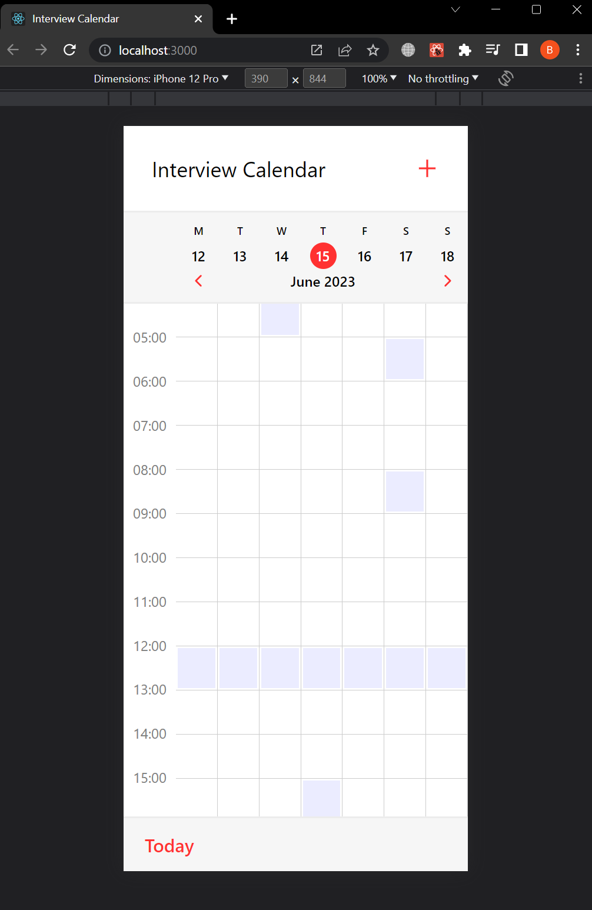
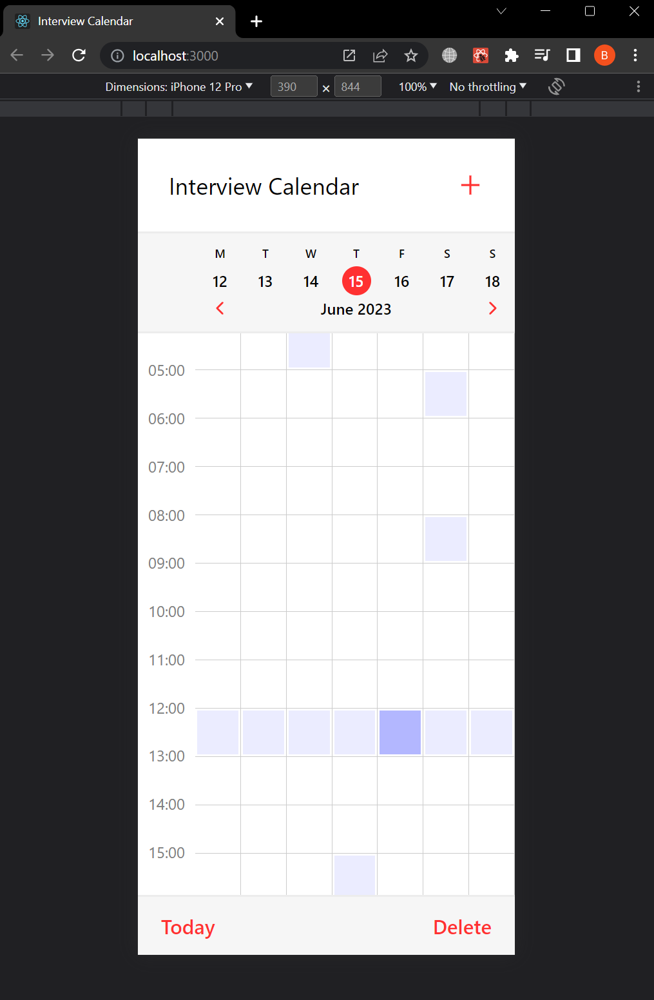
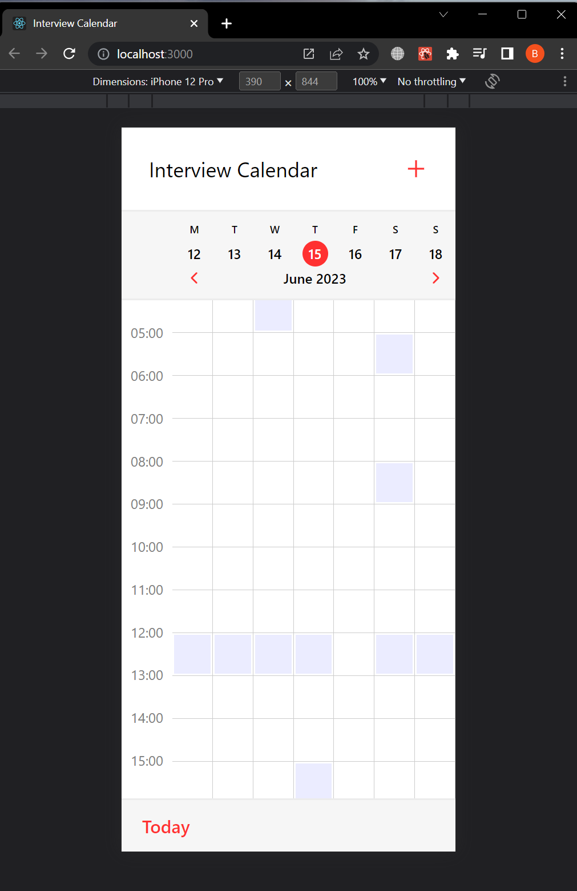
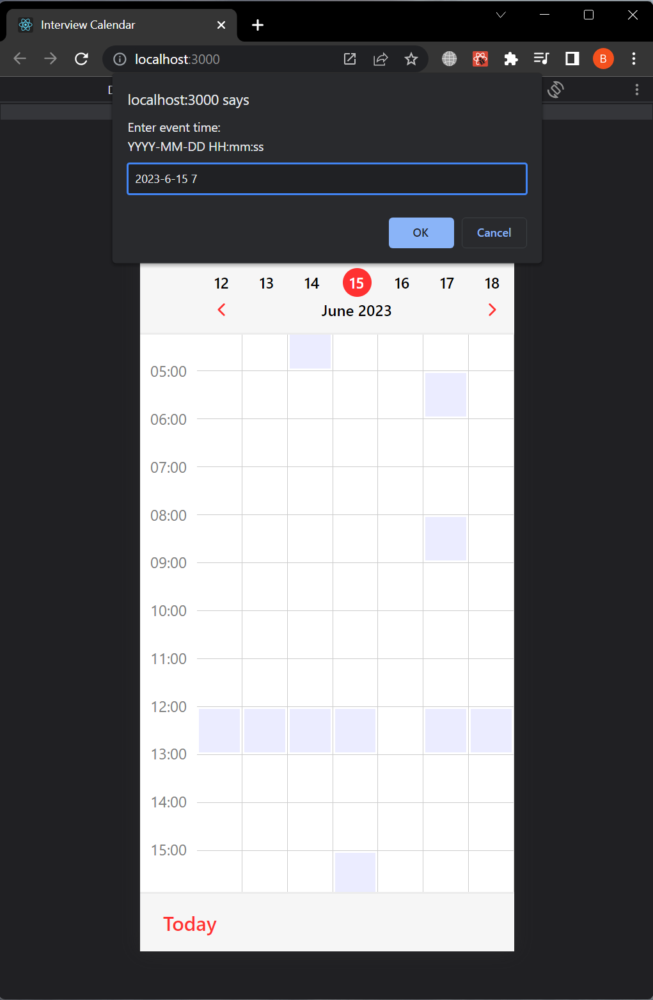
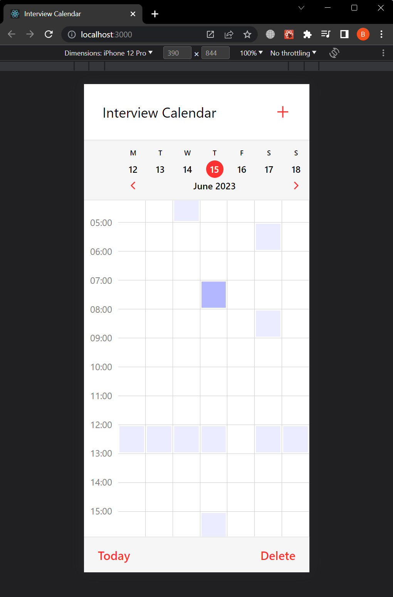

Interview Calendar

https://uchi-ru-interview-calendar.netlify.app/

Uchi.ru Interview Calendar Front

Данный репозиторий содержит код фронт-энда для приложения Interview Calendar компании Uchi.ru. Interview Calendar - это веб-инструмент, предназначенный для упрощения планирования.

Скриншоты приложения

 

### 1. Общий вид приложения

### 2. При выборе события появляется кнопка "Delete"

### 3. Результат удаления события

### 4. При нажатии иконки плюс сверху справа появляется prompt dialog куда вы можете ввести дату нового события. Prompt поддерживает множество вариантов ввода пользователя основанного на приведенном формате

### 5. Результат создания события

### 6. Если ширина экрана более 740 px, то календарь центрируется посередине и принимает ширину 740px

 

Установка

 
Чтобы запустить Interview Calendar локально, выполните следующие шаги:

Склонируйте репозиторий:

    git clone https://github.com/valdemar-leontev/uchi-ru-interview-calendar-front.git

Перейдите в директорию проекта:

    cd uchi-ru-interview-calendar-front

Установите зависимости с помощью выбранного вами менеджера пакетов. Например, с использованием npm:

    npm install

Запустите сервер разработки:

    npm start

Откройте веб-браузер и перейдите по адресу http://localhost:3000, чтобы получить доступ к приложению Interview Calendar.

